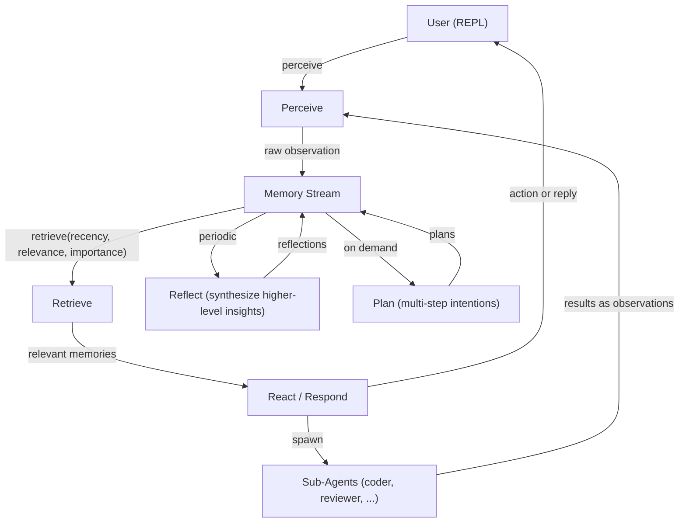

# Interactive Mode Documentation

## 1. Introduction and when to use it

agent-llm provides an **interactive REPL** where you talk to a single "interactive" agent. This agent remembers the ongoing conversation through a memory stream and can spawn specialized subagents to delegate complex tasks.

This contrasts with **batch mode**, where you pass a one-shot task string and a supervisor distributes the work among agents until the queues drain. In interactive mode, you have an ongoing dialogue with an agent that has memory, reflection capabilities, and access to tools.

For a quick guide on running the interactive session, see the [Quick Start](#2-quick-start-how-to-run-the-interactive-session) section below.

## 2. Quick Start: how to run the interactive session

You can launch the interactive session directly from the command line:

- **Default (no task):**
  ```bash
  agent-llm
  ```
  Running without arguments defaults to interactive mode.

- **Explicit interactive flag:**
  ```bash
  agent-llm -i
  # or
  agent-llm --interactive
  ```

*(For contrast, batch mode is triggered when you provide a task: `agent-llm "Build a module"`)*

**Prerequisites:**
- `OPENROUTER_API_KEY` must be set in your environment (or in a `.env` file).
- Redis must be running (e.g., `docker run -d -p 6379:6379 redis`).

**Optional flags** available in interactive mode:
- `--work-dir`: Set the working directory (default: CWD).
- `--model`: Specify the LLM model used for subagents, reflection, and importance scoring.
- `--interactive-model`: Specify a separate (typically smarter) model for the interactive agent itself. When set, the interactive agent uses this model while subagents still use `--model`. Useful for better meeting setup and agent creation reasoning.
- `--reflection-threshold`: Set the cumulative importance threshold before auto-reflection triggers (default: 50).
- `--agents-registry`: Path to the agents JSON configuration.
- `--sessions-dir`: Directory for session persistence.
- `--verbose` / `--quiet`: Control output verbosity.

*What you'll see:* You will be presented with a `you>` prompt. You can type messages and press Enter, and the agent will reply. Slash commands (starting with `/`) are also available.

## 3. High-level architecture (generative agent)

The interactive mode is inspired by the Generative Agents architecture, operating on three cognitive layers:



- **Perceive:** Every user message and agent response is scored for importance and stored as an observation in the memory stream.
- **Memory stream:** An append-only log of observations, reflections, and plans.
- **Retrieve:** Before each reply, the agent fetches top-k memories scored by recency, relevance, and importance, injecting them into the context.
- **Reflect:** Periodically (or via `/reflect`), the system synthesizes higher-level insights from recent important memories and appends them as new reflections.
- **Plan:** On demand (via `/plan <goal>`), the system produces a step-by-step plan based on relevant memories and stores it in the stream.

## 4. Memory stream in detail

The **Memory Stream** is an append-only log persisted to a JSONL file (e.g., `sessions/interactive_agent.memory.jsonl` or `.agent-llm/sessions/interactive_agent.memory.jsonl`). Each line is a single JSON object.

A `MemoryEntry` contains:
- `id`: Unique identifier.
- `created_at`: Timestamp.
- `kind`: Category (`observation`, `reflection`, or `plan`).
- `content`: The text content.
- `importance`: An integer from 1–10.
- `embedding`: Optional float vector for relevance scoring.

**Importance & Embeddings:**
- The LLM automatically scores each new observation or response on a scale of 1-10 (defaulting to 5 on failure).
- If an embedder is configured (using the OpenRouter client's `embed()` method), each entry gets an embedding for relevance retrieval.

**Retrieval Formula:**
When retrieving memories, each entry is scored as:
`Score = Recency × Relevance × Importance (normalized)`
- *Recency:* Exponential decay over time (e.g., `0.995^hours_ago`).
- *Relevance:* Cosine similarity between the query embedding and memory embedding (defaults to 1.0 if no embedder is configured).
- *Importance:* Normalized from 1-10 to 0.1-1.0.

The system retrieves the top-k memories based on this score.

**Cumulative Importance:**
The system tracks the sum of importance scores of all observations since the last reflection. Once this exceeds the `--reflection-threshold` (default 50), the `maybe_reflect` process runs automatically.

## 5. Turn-by-turn flow (what happens on each user message)

When you interact with the agent, the following exact sequence occurs:

1. **Input:** You type a line. If it starts with `/`, it's handled as a slash command and the rest of the flow is skipped.
2. **Perceive:** The system scores the importance of your message using the LLM and adds it to the memory stream (`kind="observation"`).
3. **Retrieve:** The system queries the memory stream (`memory.retrieve(user_input, k=10)`) for relevant past context.
4. **Build context:** The system prompt, the retrieved "Relevant memories from your experience," and the recent conversation history are assembled.
5. **React:** The interactive agent runs its tool-call loop. It may read files, search, or call `spawn_subagent`. Tool calls are displayed in real-time.
6. **Store response:** The assistant's reply is appended to the conversation, scored for importance, and added to the memory stream.
7. **Maybe reflect:** The system checks if the cumulative importance threshold is met. If so, it generates reflections, displays them, and adds them to the stream.
8. **Display:** The agent's final reply is printed to the console (`agent>`).
9. **Persist:** The conversation is saved to the session store. (The memory stream is already persisted during the `add` operations).

## 6. Slash commands

| Command | Arguments | Behavior |
| --- | --- | --- |
| `/help` | None | Show the list of slash commands and usage. |
| `/quit`, `/exit` | None | Exit interactive mode. |
| `/memory` | `[query]` | Retrieve top-10 memories by query, or the 15 most recent if no query. Displays kind, importance, and a snippet. |
| `/reflect` | None | Force a reflection cycle (ignores the threshold). Generated reflections are shown and saved. |
| `/plan` | `<goal>` | Create a plan for the given goal using relevant memories. The plan is stored in the memory stream and printed. |
| `/meeting` | `[topic]` | Start the pre-meeting dialogue. The interactive agent asks about participants, goals, and whether new agents are needed. It creates any missing agents and then runs the meeting. |
| `/spawn` | `<agent_id> <task>` | Run one subagent turn synchronously. The result is added to the memory stream as an observation and printed. |
| `/agents` | None | List the available subagents and their descriptions from the registry. |
| `/clear` | None | Clear the in-memory conversation buffer. The **memory stream file is unchanged**, but the immediate context is wiped for the next turn. |
| `/save` | None | Save the session explicitly (though conversations are saved automatically after every turn). |

## 7. Subagents

Subagents are specialized workers defined in your agent registry (e.g., `.agent-llm/agents.json`). Common subagents include `architect`, `coder`, and `reviewer`.

**How they are used:**
- **By you (the user):** You can manually trigger a subagent via `/spawn <agent_id> <task>`.
- **By the interactive agent:** The interactive agent can autonomously decide to delegate using its `spawn_subagent` tool.

**How spawning works:**
The system loads the subagent's session, appends the task as a user message, and runs a standard `agent.run()` cycle. The subagent's final response is returned to the interactive agent (and optionally you), and is stored in the memory stream.

**Session Persistence:**
Each subagent maintains its own session file (e.g., `sessions/coder.json`). The interactive agent uses `sessions/interactive_agent.json` for its conversation and `sessions/interactive_agent.memory.jsonl` for its memory stream.

**Meetings: pre-meeting dialogue and dynamic agents**

Use `/meeting [topic]` or simply tell the agent you want a meeting. The interactive agent will **not** immediately start the meeting; instead it enters a pre-meeting dialogue:

1. **Clarifying questions:** The agent asks which agents should attend, what the goal or desired outcome is, and whether any new participants are needed that don't exist yet.
2. **Dynamic agent creation:** If a required role is missing from the registry, the agent calls `create_agent` to add it on the fly. New agents are saved to the registry by default so they are available in future sessions.
3. **Running the meeting:** Once participants and goals are confirmed, the agent calls `create_meeting` to start the discussion.

```
you> /meeting architecture review
agent> I'd be happy to set up a meeting on "architecture review". A few questions:
       1. Which agents should attend? Currently available: architect, coder.
       2. What is the goal? (e.g. agree on module structure, review a proposal…)
       3. Do we need any new roles — e.g. a security reviewer or data engineer?
you> Let's add a security_expert and include all three plus the architect.
agent> [tool] create_agent(agent_id='security_expert', description='Reviews system design for security vulnerabilities and best practices.')
       [tool] create_meeting(topic='architecture review', agent_ids='architect,coder,security_expert')
```

- **Preparation:** Before the discussion, each participant reads their persona and the meeting topic, and prepares 1–2 questions or discussion points.
- **Discussion:** In round-table turns, each subagent sees the full transcript. They can ask new questions, answer others' questions, or add their view.
- **Plan:** After the discussion, the system produces a plan: agreed decisions, concrete next steps, and open questions.
- **Storage:** The full transcript and plan are saved under `sessions/meetings/` with a timestamped filename (e.g. `meeting_architecture_review_2026-02-24_14-30-00.md`). The result is also stored in the memory stream.

## 8. Tools available to the interactive agent

The interactive agent comes equipped with:
- **Default tools:** `list_files`, `read_file`, `search_docs` (restricted to the workspace).
- **Assignable tools:** e.g., `write_file`.
- **Sandbox tool:** For executing code securely.
- **Custom registry tools:** Any custom tools you've added in `tools.json`.
- **`spawn_subagent`:** Delegate a single task to one subagent; returns that subagent's response.
- **`create_meeting`:** Run a meeting: multiple subagents discuss a topic in round-table fashion and produce a shared summary/plan.
- **`create_agent`:** Create a new agent at runtime and add it to the registry. The agent is immediately usable in meetings and spawns. Parameters: `agent_id` (e.g. `security_expert`), `description`, and optional `persist` (default: `true` — saves to the agents registry file).

## 9. Configuration and file locations

- **Work directory:** Configured via `--work-dir` (default: CWD). Agents operate on files strictly under this path.
- **Sessions directory:** Where session JSON files and the memory JSONL file live. Resolved to `work_dir/.agent-llm/sessions` (if present) or `work_dir/sessions`. Override with `--sessions-dir`.
- **Memory file:** Saved as `{sessions_dir}/interactive_agent.memory.jsonl`.
- **Agent registry:** Configured via `--agents-registry`. Defaults to `work_dir/.agent-llm/agents.json` or `work_dir/agents/registry.json`. New agents created at runtime are persisted here (unless `persist=false` is passed to `create_agent`).
- **Model:** OpenRouter model ID used for subagents, reflection, and importance scoring (`--model`).
- **Interactive model:** Optional dedicated model for the interactive agent (`--interactive-model`). Use a more capable model here for better meeting setup and agent-creation reasoning, while subagents run on the lighter `--model`.
- **Reflection threshold:** Configurable via `--reflection-threshold` (default: 50). A higher value means the agent reflects less frequently.

## 10. Persistence summary

- **Conversation (current session):** The rolling list of user/assistant messages is saved after each turn to `interactive_agent.json`. Using `/clear` wipes this immediate context from memory but does not delete the memory stream.
- **Memory stream:** The `interactive_agent.memory.jsonl` file is an append-only log. It is **never** cleared by `/clear` and grows across runs. Because the path is tied to your sessions directory, the same project reuses the same memory file across restarts.

## 11. Optional extras

**Troubleshooting:**
- *OPENROUTER_API_KEY not set:* Ensure you have copied `.env.example` to `.env` and populated your API key.
- *Redis connection refused:* Make sure your Redis container or local service is running on port 6379.
- *No agents configured:* Check that your `agents.json` registry exists and contains valid agent definitions.

**Example Session:**
```
Interactive agent  14:32:01
Available subagents: architect, coder, reviewer
Type /help for commands, /quit to exit.

you> We need to build a new Python CLI tool for scraping.
  interactive [tool]  spawn_subagent(agent_id='architect', task='Create a high-level plan for a Python CLI scraping tool.') ✓
  interactive [out]↩ I have asked the architect to create a high-level plan.
you> /memory
  observation (imp=7) We need to build a new Python CLI tool for scraping.
  observation (imp=8) Subagent architect result: The plan includes...
you> /plan "Implement the scraper"
  [ts]Creating plan...[/ts]
  [ts]1. Set up the Python project structure.
  2. Implement the CLI interface using argparse.
  3. Add the scraping logic using BeautifulSoup.
  4. Write unit tests.[/ts]
```